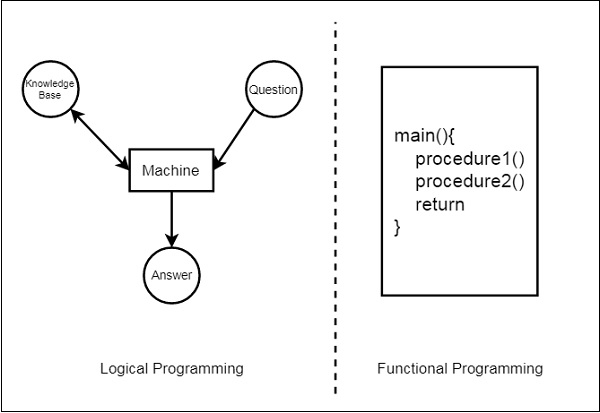
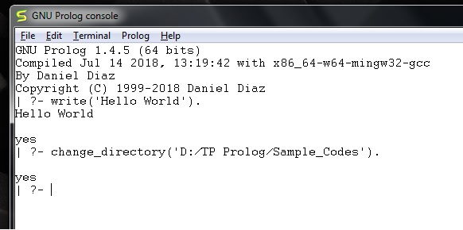

# Day 1

Prolog as the name itself suggests, is the short form of LOGical PROgramming. It is a logical and declarative programming language. Before diving deep into the concepts of Prolog, let us first understand what exactly logical programming is.

Logic Programming is one of the Computer Programming Paradigm, in which the program statements express the facts and rules about different problems within a system of formal logic.


## Logic and Procedural Programming

From this illustration, we can see that in Functional Programming, we have to define the procedures, and the rule how the procedures work. These procedures work step by step to solve one specific problem based on the algorithm. On the other hand, for the Logic Programming, we will provide knowledge base. Using this knowledge base, the machine can find answers to the given questions, which is totally different from functional programming.



In functional programming, we have to mention how one problem can be solved, but in logic programming we have to specify for which problem we actually want the solution. Then the logic programming automatically finds a suitable solution that will help us solve that specific problem.

## What's Prolog?

Prolog or PROgramming in LOGics is a logical and declarative programming language. It  is particularly suitable for programs that involve symbolic or non-numeric computation. This is the main reason to use Prolog as the programming language in Artificial Intelligence, where symbol manipulation and inference manipulation are the fundamental tasks.

In Prolog, we need not mention the way how one problem can be solved, we just need to mention what the problem is, so that Prolog automatically solves it. However, in Prolog we are supposed to give clues as the solution method.

Prolog language basically has three different elements.

- Facts: The fact is predicate that is true, for example, if we say, “Tom is the father of Jack”, then this is a fact.

```prolog
father(X, Z).
```

- Rules: Rules are extinctions of facts that contain conditional clauses. To satisfy a rule these conditions should be met.

```prolog
grandfather(X, Y) :- father(X, Z), parent(Z, Y).
```

## Hello World Program

After running the GNU prolog or an interactive Prolog instance in your terminal, we can write hello world program directly from the console. To do so, we have to write the command as follows

```prolog
write('Hello World').
```

Now let us see how to run the Prolog script file (extension is *.pl) into the Prolog console.

Before running *.pl file, we must store the file into the directory where the GNU prolog console is pointing, otherwise just change the directory by the following steps −

Step 1 − From the prolog console, go to File > Change Dir, then click on that menu.

Step 2 − Select the proper folder and press OK.


Now we can see in the prolog console, it shows that we have successfully changed the directory.



