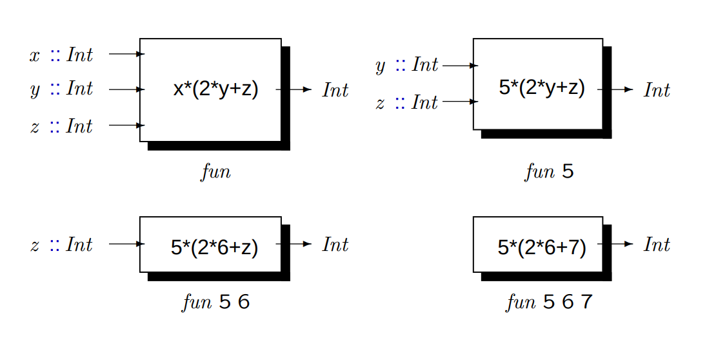

# Sessió 2


## Lambdas

Les expressions lambda són bàsicament funcions anònimes, que típicament es fan servir quan només volem fer servir la funció una vegada en un lloc puntual. Un cas freqüent és passar una expressió labmda a una funció d'ordre superior.
Típicament les posem entre parèntesis, ja que altrament abarquen tot el que tenen a la dreta. 

Exemples:

```haskell
GHCi> :t (\x -> x+1)
(\x -> x+1) :: Num a => a -> a
GHCi> (\x -> x+1) 10
11
```
```haskell
GHCi> :t (\x y -> x+y)
(\x y -> x+y) :: Num a => a -> a -> a
GHCi> (\x y -> x+y) 1 2
3
GHCi>
```

Exemple:

```haskell
GHCi> aplicaDosCops f x = f (f x)
GHCi> :t aplicaDosCops
aplicaDosCops :: (a -> a) -> a -> a
GHCi> aplicaDosCops (\x -> x+1) 1
3
```
## Aplicació parcial

Si `f` és una funció de `n` arguments i s’hi apliquen `k ≤ n` arguments amb els tipus apropiats, s’obté com a resultat una nova funció que espera els `n − k` arguments restants.

Exemple:

```haskell
fun :: Int -> Int -> Int -> Int
fun x y z = x*(2*y + z)
```



## Operadors

Els operadors són funcions de dos arguments amb un nom simbòlic. Normalment s’utilitzen amb notació infixa.

Exemple:

```haskell
GHCi> 1 + 2
3
```

Però també es poden utilitzar amb notació prefixa si els posem entre parèntesis.

Exemple:

```haskell
GHCi> (+) 1 2
3
```

I, al revés, una funció amb dos arguments es pot utilitzar amb notació infixa.

```haskell
GHCi> 10 `div` 3
3
```

Per definir operadors es poden utilitzar un o més dels següents símbols:

```haskell
: ! # $ % & ∗ + . / < = > ? @ \ ∧ | − ∼
```

Un operador té la seva pròpia prioritat. La prioritat va de `0` a `9`. Com més gran és el número, més gran és la prioritat.

A més a més de la prioritat, els operadors també tenen associativitat pròpia. Pot ser associativitat a l’esquerra `infixl`, a la dreta `infixr` o cap `infix`.

Aquí pots veure la definició dels operadors del GHCi.

```haskell
infixr 9 .
infixl 9 !!
infixr 8 ∧, ∧∧, ∗∗
infixl 7 ∗, /, ‘quot‘, ‘rem‘, ‘div‘, ‘mod‘
infixl 6 +, −
infixr 5 :
infixr 5 ++
infix  4 ==, /=, <, <=, >=, >, ‘elem‘, ‘notElem‘
infixr 3 &&
infixr 2 ||
infixl 1 >>, >>=
infixr 1 =<<
infixr 0 $, $!, ‘seq‘
```
L'aplicació té prioritat 10. 

Podem crear els nostres propis operadors. Imagina que volem crear un operador xor.

Exemple:

```haskell
-- Definim el tipus d’associativitat i la prioritat
infixr 2 |||

(|||) :: Bool -> Bool -> Bool
True ||| True   = False
False ||| False = False
_ ||| _         = True
```

Finalment, els operadors binaris tenen seccions. Les seccions són operadors parcialment aplicats. La secció d’un operador s’obté escrivint l’operador i un dels seus arguments entre parèntesis. S’obtenen funcions d’un sol argument.

Si (✶) és un operador, tenim les següents equivalències:

```haskell
(✶)   ===> \x y -> x ✶ y
(x ✶) ===> \y -> x ✶ y
(✶ y) ===> \x -> x ✶ y
```

## Funcions d'ordre superior

Les funcions d'ordre superior són aquelles que reben una o més funcions com a paràmetre. 
Són útils perquè permeten capturar esquemes computacionals generals (abstracció).

Exemple:

```haskell
aplicaDosCops :: (a -> a) -> a -> a
aplicaDosCops f x = f (f x)
```

Fixeu-vos amb la declaració de tipus. En la majoria de casos no necessitem parèntesis. En aquest cas són necessàris (recordeu que 
el constructor de tipus
`->` és associatiu a la dreta).
En aquest cas, s'indica que el primer paràmetre és una funció que rep un valor de tipus `a` i retorna un valor del mateix tipus `a`.


## Captura del càlcul amb funcions d'ordre superior

Moltes funcions que treballen amb nombres segueixen aquest esquema:

- Cas base: retornen un valor base
- Pas recursiu: es calcula el pas `n` a partir del pas `n-1`

Exemple:

```haskell
factorial :: Integer -> Integer
factorial 0 = 1
factorial n = (*) n ( factorial (n-1) )

sumatori :: Integer -> Integer
sumatori 0 = 0
sumatori n = (+) n (sumatori (n-1) )

```

Ambdues funcions segueixen l'esquema:

```haskell
fun :: Integer -> Integer
fun 0 = base
fun n =  f n (fun (n-1))
```

A partir d'això podem crear una funció d'ordre superior que capturi aquest càlcul:

```haskell
iter :: (Integer -> Integer -> Integer) ->
        Integer -> Integer -> Integer
iter f base = fun
  where
    fun :: Integer -> Integer
    fun 0 = e
    fun n = f n (fun (n-1))
```

Gràcies a capturar el patró dins d'una funció, podem definir les funcions anteriors de forma més compacta.

```haskell
factorial :: Integer -> Integer
factorial = iter (*) 1

sumatori :: Integer -> Integer
sumatori = iter (+) 0
```

## Polimorfisme

El polimorfisme fa referència al fenomen d’alguna cosa que pot tenir moltes formes.

### La funció identitat

```haskell
id :: a -> a
id x = x
```

La funció identitat simplement retorna el seu argument.

```haskell
GHCi> id 'd'
'd'
GHCi> id [1,2,0]
[1,2,0]
```

La funció pot semblar una mica inútil, però de vegades amb funcions d'ordre superior
és útil tenir una funció que no faci res.

```haskell
GHCi> filter id [True, False, True]
[True, True]
```

### Parells

Les funcions `fst` i `snd` permeten obtenir els components d’un parell de valors.

Podem veure que aquestes dues funcions fan servir dues variables de tipus. Això vol dir
que el tipus de cada component pot ser diferent, però no és obligatori.

```haskell
:t fst
fst :: (a, b) -> a
:t snd
snd :: (a, b) -> b
```

Exemples:

```haskell
GHCi> fst (8,11)
8
GHCi> fst ("Wow", False)
"Wow"
GHCi> snd (8,11)
11
GHCi> snd ("Wow", False)
False
GHCi> snd ("Wow", False)
False
```

Tot i que pots crear tuples de qualsevol nombre de components,
les funcions `fst` i `snd` només operen sobre parells.

```haskell
GHCi> fst (1, True, "Eeeh")
<interactive>:8:5: error:
    • Couldn't match expected type ‘(a, b0)’
                  with actual type ‘(a0, Bool, [Char])’
    • In the first argument of ‘fst’, namely ‘(1, True, "Eeeh")’
      In the expression: fst (1, True, "Eeeh")
      In an equation for ‘it’: it = fst (1, True, "Eeeh")
    • Relevant bindings include it :: a (bound at <interactive>:8:1)
```

### Llistes

Vegem algunes funcions definides sobre una llista de qualsevol tipus.
La funció està definida a un nivell tan alt d’abstracció que el tipus d’entrada concret
simplement no entra en joc, però el resultat és d’un tipus particular (de vegades).

#### Llargada

```haskell
length :: [a] -> Int
length []      = 0
length (_:xs)  = 1 + llargada xs
```

La funció `length` mostra polimorfisme paramètric perquè actua
de manera uniforme sobre una gamma de tipus que comparteixen una estructura comuna, en aquest cas, les llistes.

```haskell
GHCi> :t length [1,2,3,4,5]
length [1,2,3,4,5] :: Int
GHCi> :t length' ['1','2','3','4','5']
length ['1','2','3','4','5'] :: Int
```

#### Capçalera

Per obtenir el primer element d’una llista pots fer servir la funció `head`.

```haskell
head :: [a] -> a
head (x:_) = x
```

```haskell
GHCi> head ["hello", "world", "!"]
"hello"
GHCi> head []
*** Exception: Prelude.head: empty list
```

#### Cua

Per obtenir la resta de la llista pots fer servir la funció `tail`.

```haskell
tail :: [a] -> [a]
tail (_:xs) = xs
```

```haskell
GHCi> tail ["hello", "world", "!"]
["world", "!"]
GHCi> tail []
*** Exception: Prelude.tail: empty list
```

#### Últim

Per obtenir l'últim element d'una llista, podem fer servir la funció `last`.

```haskell
last :: [a] -> a
last [x]    = x
last (_:xs) = last xs
```

```haskell
GHCi> last ["hello", "world", "!"]
"!"
GHCi> last []
*** Exception: Prelude.last: empty list
```

La funció `init` retorna tots els elements menys l'últim.

```haskell
init :: [a] -> [a]
init [x]    = []
init (x:xs) = x : init xs
```

```haskell
GHCi> init ["hello", "world", "!"]
["hello", "world"]
GHCi> init []
*** Exception: Prelude.tail: empty list
```

#### Concatenació

L'operador de concatenació és el `++`.

```haskell
infix 5 ++
(++) :: [a] -> [a] -> [a]
[] ++ ys      = ys
(x:xs) ++ ys  = x : (xs ++ ys)
```

#### Map

La funció `map` rep com a paràmetre una funció com a primer argument, una llista com a segon argument, i retorna la llista resultant d'aplicar la funció a cadascun dels elements de la llista original.

```haskell
map :: (a -> b) -> [a] -> [b]
map _ [] = []
map f (x:xs) = f x : map f xs
```

```haskell
GHCi> map (+3) [1,5,3,1,6]
[4,8,6,4,9]
GHCi> map (++ "!") ["BIFF", "BANG", "POW"]
["BIFF!","BANG!","POW!"]
GHCi> map (replicate 3) [3..6]
[[3,3,3],[4,4,4],[5,5,5],[6,6,6]]
GHCi> map (map (^2)) [[1,2],[3,4,5,6],[7,8]]
[[1,4],[9,16,25,36],[49,64]]
GHCi> map fst [(1,2),(3,5),(6,3),(2,6),(2,5)]
[1,3,6,2,2]
```

#### Filter

`filter` és una funció que rep com a primer paràmetre una funció Booleana (un predicat) i com a segon paràmetre una llista, i retorna la sub-llista d'elements que satisfan el predicat.


```haskell
filter :: (a -> Bool) -> [a] -> [a]
filter _ [] = []
filter p (x:xs)
    | p x       = x : filter p xs
    | otherwise = filter p xs
```

```haskell
GHCi> filter (>3) [1,5,3,2,1,6,4,3,2,1]
[5,6,4]
GHCi> filter (==3) [1,2,3,4,5]
[3]
GHCi> filter even [1..10]
[2,4,6,8,10]
GHCi> let notNull x = not (null x) in filter notNull [[1,2,3],[],[3,4,5],[2,2],[],[],[]]
[[1,2,3],[3,4,5],[2,2]]
GHCi> filter (`elem` ['a'..'z']) "u LaUgH aT mE BeCaUsE I aM diFfeRent"
"uagameasadifeent"
```

## Aplicació amb l'operador $

```haskell
infixr 0 $
($) :: (a -> b) -> a -> b
f $ x = f x
```

Recordeu que l'aplicació té prioritat màxima. En canvi, si posem l'operador `$` entre la funció i el paràmetre, passa a tenir prioritat mínima. També canvia l'associativitat: l'aplicació normal (separada per espais) és associativa a l'esquerra, i l'operador `$` és associatiu a la dreta.


Per exemple, si volem calcular l'arrel quadrada de `3 + 4 + 9`, no podem escriure 
`sqrt 3 + 4 + 9`, perquè `sqrt` només s'aplicaria al primer agument, que és 3. 
Podem escriure `sqrt (3 + 4 +9)`, o bé, `sqrt $ 3 + 4 + 9`.

El `$` també ens permet fer coses com la següent:


```haskell
GHCi> map ($ 3) [(4+), (10*), (^2), sqrt]
[7.0,30.0,9.0,1.7320508075688772]
```

## Composició

En matemàtiques, la composició de funcions es defineix així:
`(fℴg)(x) = f(g(x))`. És a dir, composar dues funcions produeix una nova funció, equivalent a passar el retorn de la segona funció com a paràmetre de la primera. 

Amb Haskell, l'operador de composició és `.`:

```haskell
infixr 9 .
(.) :: (b -> c) -> (a -> b) -> a -> c
f . g = \x -> f (g x)
```

- El resultat de composar `f` i `g` és una nova funció  `f.g :: a -> c`
- El tipus de retorn de `g` ha de ser el mateix que el tipus del paràmetre de `f`, altrament tenim error de tipus.

Exemple:

```haskell
GHCi> map (\x -> negate (abs x)) [5,-3,-6,7,-3,2,-19,24]
[-5,-3,-6,-7,-3,-2,-19,-24]
GHCi> map (negate . abs) [5,-3,-6,7,-3,2,-19,24]
[-5,-3,-6,-7,-3,-2,-19,-24]
GHCi> map (\xs -> negate (sum (tail xs))) [[1..5],[3..6],[1..7]]
[-14,-15,-27]
GHCi> map (negate . sum . tail) [[1..5],[3..6],[1..7]]
[-14,-15,-27]
```

## El vostre torn

```
-- Ex 1: defineix els operadors --> , <--> (implicacio i equivalencia)
-- --> te prioritat 2
-- <--> te prioritat 1
-- Tots dos son associatius a l'esquerra
-- El seu tipus es Bool -> Bool -> Bool
```

```haskell
-- Ex 2: defineix una versió del map que rep tres paràmetres: una funció i dues llistes. Retorna la llista resultant d'aplicar la funció als elements d'el mateix índex de les dues llistes. Exemple:
--
--   map2 f [x,y,z,w] [a,b,c]  ==> [f x a, f y b, f z c]
--
-- Si les llistes tenen llargada diferent, s'ignoren els elements que sobren al final de la llista més llarga.
--
-- Fes servir pattern matching.
--
-- Crea alguna funció que utilitzi `map2` i tingui una lambda expressió com a primer paràmetre. 
--
-- Crea alguna funció que utilitzi `map2` i tingui algun operador pre-definit com a primer paràmetre.

```

```haskell
-- Ex 3: Implementa la funció maybeMap, que fa una barreja entre un map i un filter.
---
-- Donada una llista ([a]) i una funció de tipus a -> Maybe b, retorna una llista ([b])
-- Per cada element de la llista, si la funció retorna Nothing, s'exclou l'element del resultat,
-- altrament (retorna Just x) s'inclou x al resultat.
--
-- Exemples:
--
-- let f x = if x>0 then Just (2*x) else Nothing
-- in maybeMap f [0,1,-1,4,-2,2]
--   ==> [2,8,4]
--
-- maybeMap Just [1,2,3]
--   ==> [1,2,3]
--
-- maybeMap (\x -> Nothing) [1,2,3]
--   ==> []

```
