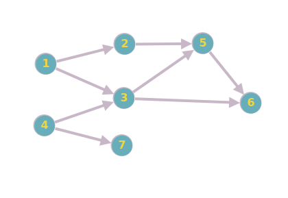
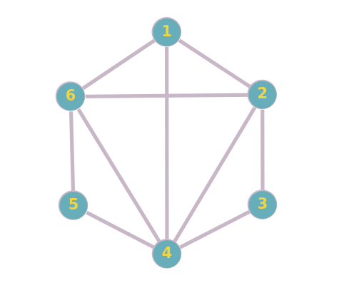

# Sessió 1

El nom Prolog deriva del francès _PROgramation LOGique_. És un llenguatge de programació declaratiu basat en lògica.

La programació lògica és un paradigma de programació declaratiu, és a dir, els programes especifiquen **quin** problema volem resoldre. Això contrasta amb la _programació imperativa_, on els programes especifiquen **com** s'ha de resoldre el problema. Altres paradigmes declaratius són la _programació funcional_ (que visitarem més tard en el curs) o la _programació basada en restriccions_.

En el cas de Prolog, un programa consisteix en un conjunt de **_fets_** i **_regles_** especificats amb el fragment de les _clàusules de Horn_ de la _lògica de primer ordre_ (també anomenada lògica de predicats).

En _lògica proposicional_ una clàusula de Horn és tota clàusula formada per disjuncio de literals que té com a molt un literal positiu. Nota: un literal és una _variable_ o la negació d'una variable.

Una clàusula de Horn pot tenir la forma:

${\displaystyle \neg p\lor \neg q\vee \cdots \vee \neg t\vee u}$

Una clàusula de Horn també es pot reescriure equivalentment com a una implicació d'una conjunció de literals positius cap a un literal positiu:

${\displaystyle p\wedge q\wedge \cdots \wedge t\rightarrow u}$

Un exemple en lògica de primer ordre (no proposicional):

${\displaystyle p(X)\wedge q(Y) \wedge t(X,Y)\rightarrow u(X,Y)}$

La clàusula anterior, en Prolog s'escriu:

${\displaystyle u(X,Y)}$ :- ${\displaystyle p(X), q(Y), t(X,Y).}$

## Programació Lògica vs Programació Imperativa

En programació imperativa, un programa consisteix en una seqüència de procediments que s'executen de manera ordenada. Tenim també estructures alternatives (_if-else_) i repetitives (_loops_).
Per altra banda, en programació lògica, un programa consisteix en una base de coneixement o teoria.
Un mecanisme subjacent de raonament trobarà resposta a les nostres consultes basant-se en la base de coneixement.


En Prolog especificarem quin problema volem resoldre i no com el volem resoldre. El **com** el gestiona l'intèrpret de Prolog internament. En particular, el còmput de les solucions es basa en un mecanisme deductiu, _SLD-resolució_.

## Prolog: definició del llenguatge

Prolog és particularment útil per fer programes de manipulació simbòlica, i per tant és un bon candidat per aplicacions d'intel·ligència artificial on la manipulació simbòlica i la inferència siguin tasques fonamentals.

Per exemplificar la simplicitat del llenguatge i els seus tres elements principals farém ús de la base de coneixement [`family.pl`](Examples/family.pl).

- **Fets**: són àtoms lògics (típicament predicats relacionant diversos elements) que són certs. Per exemple, el següent fet expressa _"En Tom és el pare d'en Jack"_.

  ```prolog
  father(tom, jack).
  ```

  El significat que donem a un fet és una decisió del programador. El fet anterior podria tenir la lectura alternativa _"el pare d'en Tom és en Jack"_. Per això és **molt recomanable** afegir comentaris sobre com llegir els predicats del programa. Per exemple:

  ```prolog
  % father(X, Y) : X es el pare de Y
  father(tom,jack).
  ```

  De fet, **Prolog ignora el significat dels fets, només en detecta l'estructura sintàctica**. Fixeu-vos que això és una propietat comuna de qualsevol llenguatge de programació. Per exemple, en un programa en C++, llevat de paraules clau del llenguatge (_if_, _bool_, ...), sempre podem reanomenar les variables, funcions, etc., sempre que siguem consistents amb totes les ocurrències dintre de l'àmbit. Semblantment, el fet anterior es podria reanomenar com a:

  ```prolog
  % f(X,Y) : X es el pare de Y
  % t: tom
  % j: jack
  f(t, j).
  ```

- **Regles**: són extensions dels fets que representen implicacions. Més concretament, són clàusules de Horn en forma d'implicació. El símbol `:-` s'ha de llegir com a *si*, o *està implicat per*. Sovint es denomina la part de l'esquerra del `:-` com a **cap**, i la part de la dreta com a **cos**. Des d'un punt de vista més proper al mecanisme d'inferència subjacent (SLD-resolució), es pot llegir com a: **si vols que demostri el cap, primer he de demostrar tots els literals del cos**. Un exemple de regla:

  ```prolog
  grandfather(X, Y) :- father(X, Z), parent(Z, Y).
  ```

  Fixeu-vos que normalment les regles contenen **variables** (identificadors que comencen en majúscula). Les variables estan quantificades universalment. És a dir, s'ha de llegir com: *"per tot valor de X, Y i Z, si X és el pare de Z i Z és el progenitor de Y, llavors X és l'avi de Y"*. **Dues variables diferents poden unificar a un mateix valor**. Si ho volem evitar, ho hem d'especificar explícitament al cos:

  ```prolog
    siblings(X, Y) :- parent(Z, X), parent(Z, Y), X\=Y.
    ```

  En canvi, **podem utilitzar la mateixa variable per assegurar que dos valors són el mateix**. L'exemple següent introdueix més variables de les necessàries:

  ```prolog
    siblings(X, Y) :- parent(A, X), parent(B, Y), A=B, X\=Y.
    ```

  Podem tenir diferents regles (diferents maneres) per arribar a la mateixa conclusió:

   ```prolog
    parent(X, Y) :- father(X, Y).
    parent(X, Y) :- mother(X, Y).
    ```

- **Consultes**: També *queries* o *objectius*. Donada una base de coneixement, formada per fets i regles, per executar un programa farem una *consulta*. A les consultes les variables estan quantificades existencialment. És a dir, fem la pregunta: _"existeix algun valor per cadascuna de les variables tal que es pugui demostrar aquesta conjunció d'àtoms?"_

  _Existeix algú (alguna X) que sigui el pare d'en Jack?_

    ```prolog
    father(X, jack).
    X = tom
    yes
    ```

  _Existeix algú (alguna X) que sigui el pare d'en Wil?_

  ```prolog
  father(X, wil).
  no
  ```

  _Existeix algú (alguna X) que sigui el pare d'en Jack i d'en Wil?_

  ```prolog
  father(X, jack), father(X, wil).
  no
  ```

  Prolog obeix l'assumpció del món tancat (_closed-world assumption_), que assumeix que qualsevol predicat que no es pot demostrat cert ha de ser fals.

## Prolog: primers passos

En aquest material treballarem sobretot amb GNU prolog, encara que hi ha altres implementacions. Tot i que es poden entrar fets i regles una per una a la consola interactiva, es recomana guardar-los en un fitxer (extensió `.pl`), i carregar-lo.

Si fem servir la consola del sistema, ho podem fer en el moment d'executar `gprolog`:

  ```console
  gprolog --consult-file fitxer.pl
  ```

Altrament, hem d'assegurar que estem ubicats al directori correcte.

  Pas 1 − File > Change Dir.

  Pas 2 − Seleccionar el directori i clicar OK.

  


  

Finalment podem carregar el fitxer. Fixeu-vos que no afegim l'extensió `.pl`.

 ```prolog
  [fitxer].
  ```

Per fer una consulta, escriurem conjunt de fets que volem demostrar, sempre acabat en punt `.`. Prolog no acaba la resolució de la consulta quan troba una resposta, sinó quan ha explorat tot l'_arbre de cerca_ (ho discutirem en les següents sessions). **Pot ser que el programa no acabi**: la implementació de la **SLD-resolució en Prolog no és completa**. En cas que la resposta a la consulta sigui *yes*, dirà quins valors prenen les variables que hi hagi. Si encara no ha explorat tot l'arbre, esperarà una instrucció:

  - `;`: continua la cerca. Mostra el següent valor de variables que demostra la consulta, si és que n'hi ha més.

  - `a`: mostra totes les solucions. Poden ser infinites!

  - `[ENTER]`: atura la cerca.

Prolog suporta _variables anònimes_, representades amb el caràcter de guió baix `_`. Cada variable anònima es considera una variable diferent. S'utilitzen quan només volem saber si la resposta d'una consulta és afirmativa o negativa independentment del valor que reben les variables de la consulta. Compara el comportament de `hates(X,tom).` i `hates(_,tom)` sobre la base de coneixement.

Fitxer: [`var_anonymous.pl`](Examples/var_anonymous.pl)

```prolog
hates(jim,tom).
hates(pat,bob).
hates(dog,fox).
hates(peter,tom).
```

Nota: fent ús de la comanda `halt.` podem sortir de l'intèrpret.

## És el vostre torn (I)

### lovers.pl

Feu servir el fitxer [`lovers.pl`](Examples/lovers.pl) i feu les següents consultes en Prolog:

- A qui li agrada en John?

- Qui li agrada a l'Ann?

- Qui està enamorat d'algú?

- Qui és estimat per algú?

- Quines dues persones s'estimen mútuament?

- Qui estima sense ser correspost? Nota: podeu fer servir la "negació" amb `\+ loves(...)`

## Els termes

En Prolog, els valors que poden prendre les variables i els paràmetres dels predicats són _termes_. Els tipus de termes que tenim són: _constants_, _variables_, i _termes complexos_ (o estructures)


- **Constants**

  - **Objectes**: són els components més bàsics de Prolog i es representen amb un identificador únic que comença amb minúscula.

  - **Nombres**: Prolog suporta operacions de nombres enters i reals (coma flotant), ho veurem més endavant.


- **Variables**: comencen amb una lletra majúscula. També tenim el cas especial de la variable anònima `_`.

- **Termes complexos**: podem definir estructures complexes com llistes, arbres i grafs fent servir combinacions de termes. Per exemple, podem definir tuples:

  ```prolog
  X = habitant(homer, adr("Evergreen Terrace", 742, "Springfield")).
  ```

## Entendre i tracejar l'execució

Quan fem una consulta, l'intèrpret de Prolog intentarà demostrar que és _conseqüència lògica_ de la base de coneixement (fets i regles) fent us de SLD-resolució. Des d'un punt de vista més pragmàtic, podem entendre el procés de demostració d'una consulta `p` com:

- Cerca en el fitxer `.pl`, **de dalt a baix**, un fet o regla que em permeti demostrar `p`.

  - Els fets sempre son certs, demostren la consulta automàticament.

  - Les regles demostren el cap si podem demostrar tots els àtoms del cos. Prolog els intentarà demostrar un per un **d'esquerra a dreta**.

  **Per demostrar un àtom amb un fet o una regla, les variables involucrades han de ser __unificables__.**

L'exemple següent és una variació de la base de coneixement [`family.pl`](Examples/family.pl) on s'ha donat un noms diferents a les variables de les regles per il·lustrar
que en realitat són variables diferents que cal unificar, però recordeu que podem repetir noms.
De fet, també cal unificar les variables involucrades en diferents crides recursives d'una mateixa regla!


```prolog
father(tom,jack). %f1
father(tom,lisa). %f2
father(wil,tom).  %f3
mother(ann,tom).  %f4
mother(ann,john). %f5
parent(X1,Y1):-father(X1,Y1). %r1
parent(X2,Y2):-mother(X2,Y2). %r2
grandfather(X3,Y3):-father(X3,Z3),parent(Z3,Y3).     %r3
siblings(X4,Y4):-parent(Z4,X4),parent(Z4,Y4),X4\=Y4. %r4
```

La consulta `? father(X,Y).` primer es demostrarà amb `f1` i unificant $\\{X \rightarrow tom, \ Y \rightarrow jack\\}$. Si demanem més solucions es demostrarà amb `f2` unificant $\\{X \rightarrow tom, \ Y \rightarrow lisa\\}$, i finalment amb `f3` unificant $\\{X \rightarrow wil, \ Y \rightarrow tom\\}$.

La consulta `? father(tom,X).` només es demostrarà amb `f1` i `f2`, però no amb `f3` perquè NO es pot unificar $\\{tom \rightarrow will\\}$.

La consulta `? parent(tom,Y).` es demostrarà:

  - Primer amb `r1`, unificant $\\{X1 \rightarrow tom, \ Y \rightarrow Y1\\}$. Això implica demostrar `father(tom,Y1)`, que admet diverses solucions.

  - Després es provarà de demostrar amb `r2` unificant $\\{X2 \rightarrow tom, \ Y \rightarrow Y2\\}$. Això implica demostrar `mother(tom,Y2)`, que no és demostrable ni amb `f4` ni amb `f5`(no podem unificar $\\{tom \rightarrow ann\\}$).

La consulta `? siblings(X,Y).` es demostrarà amb `r4` unificant $\\{X \rightarrow X4, \ Y \rightarrow Y4\\}$. Això implica demostrar, **en aquest ordre**, `parent(Z4,X4)`, `parent(Z4,Y4)`, `X4\=Y4`.

En Prolog podem tracejar l'execució. Per entrar en el mode de *tracing*, escriurem `trace.` Per sortir del mode de *tracing*, entreu `notrace.`. El següent exemple mostra quins fets i quines regles s'utilitzen i quines unificacions es fan per deduir que en Jack i la Lisa són germans amb la consulta `siblings(X,Y).`


### Exercici

Expandiu la base de coneixement [`ancestor.pl`](Exercicis/ancestor.pl) i execute primer sence tracing, la consulta `ancestor(X,Y).`, amb les següents regles lògicament equivalents.

Quin és el comportament en cada cas? Sabrieu dir per què? Feu servir el tracer per mirar què passa si cal.

- I)

  ```prolog
    ancestor(X,Y):-parent(X,Y).
    ancestor(X,Y):-parent(X,Z),ancestor(Z,Y).
    ```

- II)

  ```prolog
    ancestor(X,Y):-parent(X,Y).
    ancestor(X,Y):-ancestor(Z,Y),parent(X,Z).
    ```

- III)

  ```prolog
    ancestor(X,Y):-parent(X,Z),ancestor(Z,Y).
    ancestor(X,Y):-parent(X,Y).
    ```

- IV)

  ```prolog
    ancestor(X,Y):-ancestor(Z,Y),parent(X,Z).
    ancestor(X,Y):-parent(X,Y).
    ```

## És el vostre torn (II)

### Els simpson

Donada la base de coneixement de [`els_simpsons.pl`](Examples/els_simpson.pl), definiu les regles següents:

- ancestre
- avi
- avia
- oncle
- tia

### Graf dirigit

Representeu el següent graf dirigit mitjançant fets, i definiu la regla `cami(X,Y)`, que detecta si hi ha un camí de `X` a `Y`.



### Cliques

Representeu mitjançant fets el següent graf, i definiu les regles `clique3(A,B,C)` i `clique4(A,B,C,D)`. Feu-ho també de manera que cada clique es detecti una sola vegada (sense permetre permutacions). Per exemple, si ja hem trobat el clique de 3; `A=1`, `B=4`, `C=6`, no volem detectar també el `A=1`, `B=6`, `C=4`.



<details>
  <summary>Pista (primer proveu-ho sense mirar-la)</summary>
  Podeu definir una noció d'ordre a les arestes, i fer que la solució sigui ordenada.
</details>

Mireu també les primeres 13 transparències del PdF.
