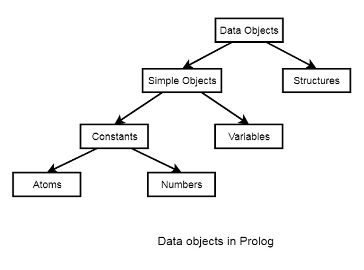

# Session 1

Prolog as the name itself suggests, is the short form of LOGical PROgramming. It is a logical and declarative programming language. Before diving deep into the concepts of Prolog, let us first understand what exactly logical programming is.

Logic Programming is one of the Computer Programming Paradigm, in which the program statements express the facts and rules about different problems within a system of formal logic.

## Logic and Procedural Programming

From this illustration, we can see that in Functional Programming, we have to define the procedures, and the rule how the procedures work. These procedures work step by step to solve one specific problem based on the algorithm. On the other hand, for the Logic Programming, we will provide knowledge base. Using this knowledge base, the machine can find answers to the given questions, which is totally different from functional programming.


In functional programming, we have to mention how one problem can be solved, but in logic programming we have to specify for which problem we actually want the solution. Then the logic programming automatically finds a suitable solution that will help us solve that specific problem.

## What's Prolog?

Prolog or PROgramming in LOGics is a logical and declarative programming language. It  is particularly suitable for programs that involve symbolic or non-numeric computation. This is the main reason to use Prolog as the programming language in Artificial Intelligence, where symbol manipulation and inference manipulation are the fundamental tasks.

In Prolog, we need not mention the way how one problem can be solved, we just need to mention what the problem is, so that Prolog automatically solves it. However, in Prolog we are supposed to give clues as the solution method.

Prolog language basically has three different elements.

- Facts: The fact is predicate that is true, for example, if we say, “Tom is the father of Jack”, then this is a fact.

```prolog
father(X, Z).
```

- Rules: Rules are extinctions of facts that contain conditional clauses. To satisfy a rule these conditions should be met.

```prolog
grandfather(X, Y) :- father(X, Z), parent(Z, Y).
```

- Questions: And to run a prolog program, we need some questions, and those questions can be answered by the given facts and rules. In queries, variables are existentially quantified. The question is whether there exists a value for the variables that makes a certain conjunction of atoms true according to the theory.

```prolog
father(X, wil).
X = santos ? ;
no
```

## Hello World Program

After running the GNU prolog or an interactive Prolog instance in your terminal, we can write hello world program directly from the console. To do so, we have to write the command as follows

```prolog
write('Hello World').
```

Now let us see how to run the Prolog script file (extension is *.pl) into the Prolog console.

Before running *.pl file, we must store the file into the directory where the GNU prolog console is pointing, otherwise just change the directory by the following steps −

Step 1 − From the prolog console, go to File > Change Dir, then click on that menu.

Step 2 − Select the proper folder and press OK.


Now we can see in the prolog console, it shows that we have successfully changed the directory.


Step 3 − Now create one file (extension is *.pl) and write the code as follows. Or use the [hello.pl](Examples/hello.pl) already given for you.

```prolog
main :- write('Hello World').
```

## Data types in Prolog

In Prolog, the main data types are atoms, numbers, and terms.

- Atoms: Atoms are the basic building blocks of Prolog, and they represent a unique identifier, such as a constant or a string. Atoms can be either an atom name, like "dog" or "cat", or a string enclosed in single quotes, like 'dog' or 'cat'.

- Numbers: In Prolog, numbers are used to represent integers, floating-point numbers, or rational numbers. They are used to perform mathematical operations, like addition, subtraction, and multiplication.

- Terms: A term is a combination of atoms, numbers, and other terms, connected by a functor. For example, the term "dog(fido)" is a combination of the atom "dog" and the atom "fido", connected by the functor "()".

In Prolog, a variable is also a data type. Variables in Prolog start with an uppercase letter, like X or Y, and they can be used to represent any value.

PSS: Prolog is a dynamically typed language, so the type of a term is not fixed and can change during the execution of a program. In Prolog, you can define terms that represent more complex data structures, like lists, trees, and graphs, using a combination of atoms, numbers, and other terms.

For example, you can define a term to represent a point in two-dimensional space, like this:

```prolog
point(X, Y).
```

By defining these custom data types, you can write more expressive and readable Prolog programs that can solve more complex problems.

For a practical implementation see the knowledge base of the [var_anonymous.pl script](Examples/var_anonymous.pl).



## Anonymous Variables in Prolog

Anonymous variables have no names. The anonymous variables in prolog is written by a single underscore character ‘_’. One important thing is that each individual anonymous variable is treated as different. They are not same.

Now the question is, where should we use these anonymous variables? It's usuful when what matters is to know if exist any constant that in variable sustitution satisty the logic equation instead of knowing which are the terms that satisfy the logic equation.

<details>
    <summary>Toggle me to see the var_anonymous.pl knowledge</summary>

```prolog
hates(jim,tom).
hates(pat,bob).
hates(dog,fox).
hates(peter,tom).
```
</details>


## Tracing the ouput

In Prolog we can trace the execution. To trace the output, you have to enter into the trace mode by typing “trace.”. Then from the output we can see that we are just tracing “marge is mother of whom?”. See the tracing output by taking X = marge, and Y as variable, there Y will be { bart, maggie ... } as answer. To come out from the tracing mode press “notrace.”

Given the knowledge:

<details>
    <summary>Toggle me to see the knowledge</summary>

```prolog
nen(bart).
nen(milhouse).
nen(lisa).
nen(maggie).
nen(rod).
nen(todd).
nen(ralph).

home(abe).
home(homer).
home(bart).
home(ned).
home(rod).
home(todd).
home(chief_wiggum).
home(ralph).
home(milhouse).
home(mr_burns).
home(smithers).
home(groundskeeper_willie).
home(principal_skinner).

dona(marge).
dona(lisa).
dona(maggie).
dona(maude).
dona(mrs_krabappel).
dona(ms_hoover).
dona(patty).
dona(selma).
dona(jacqueline).

pare(abe, homer).
pare(homer, bart).
pare(homer, lisa).
pare(homer, maggie).
pare(ned, rod).
pare(ned, todd).
pare(chief_wiggum,ralph).

mare(marge, bart).
mare(marge, lisa).
mare(marge, maggie).
mare(jacqueline, marge).
mare(jacqueline, patty).
mare(jacqueline, selma).
mare(maude, rod).
mare(maude, todd).

casat(homer, marge).
casat(ned, maude).

amic(bart, milhouse).
amic(homer, ned).
amic(marge, maude).

viu(homer, adr("Evergreen Terrace", 742, "Springfield")).
viu(ned, adr("Evergreen Terrace", 744, "Springfield")).
```

</details>


## It's your turn to practice

### lovers.pl

Use the knowledge in lovers.pl and write in Prolog the following questions.

- Who does "John" love?
- Who loves "Ann"?
- Who loves someone?
- Who is loved by someone?
- Who love each other mutually?
- Who loves without being loved back?

### els_simpsons.pl

Given the knowlage of els_simpsons.pl, think how would you define the following questions.

- Ancestor
- Grandfather
- Grandmother
- Uncle
- Aunt

[^1]: [tutorialspoint](https://www.tutorialspoint.com/prolog)
